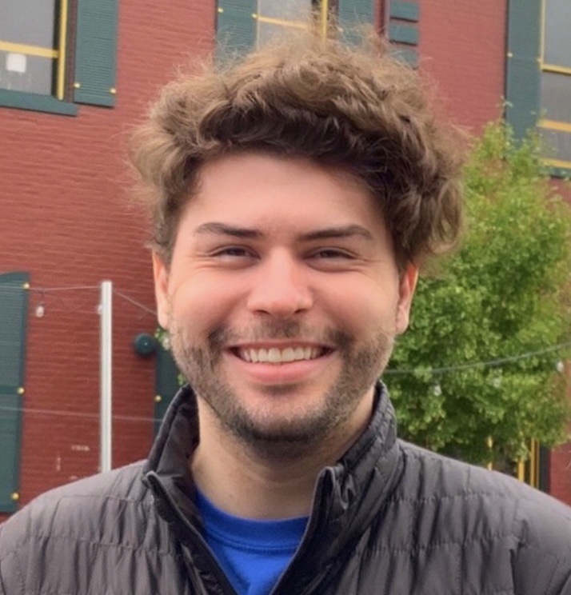

# **Zach Jorgensen**

<h2 align="center" display: inline>
Hey! I'm Zach!
</h2>

<h3 align="center">
Associate DevOps Engineer  and Game Enthusiast :video_game:
</h3>
 

## Personal Links :computer:

## Who Am I? :raising_hand:

Welcome to my repository! :wave:

I am an associate at Liatrio and was hired on through the apprenticeship program as a wave one, the Lone Lasting Bengal! :tiger:

Even though I'd like to see rain more than once a year, I am currently living in hot and sunny Chico, CA. :smile:

I graduated from Chico State in 2022 with a bachelor's degree in Computer Science. :mortar_board:

## My Working Style :key:

Collaboration is key. Being able to bounce ideas off of other people is a must. It helps avoid errors and improves the quality of the work. So don't be afraid to ever reach out and ask for help. :handshake:

Although challenging, ensuring that I am able to destress from a long day of work is a priority. Thus, I do my best to manage a good work-life balance. :briefcase:

## How to communicate :mailbox_with_mail:

I am almost always on Slack, so feel free to reach out to me there! You can also find me on LinkedIn. :iphone:

## Coffee Talk :coffee:

- :space_invader: Video and tabletop games
- :robot: New emerging tech
- :movie_camera: Shows and movies
- :guitar: Guitar, piano, and music

## Hobbies :game_die:

Outside of work, here are some of the things I really enjoy doing:
- :airplane: Traveling - absolutely love traveling to new places!
- :video_game: Video Games - exploring beautiful worlds outside our own!
- :dragon: Tabletop Games - dungeon crawling in GURPS and DnD! 
- :snowboarder: One Wheeling - going out trail riding on my OneWheel!
- :musical_note: Music - ALL genres of music!

## Weaknesses :chart_with_downwards_trend:

- Struggle separating work from my personal life. When a project or problem is left unfinished, I tend to focus on it well after work is over. 
- Although I enjoy learning new things, I get easily embarrassed while doing so if I'm with others. This can lead to me feeling self-conscious and awkward in the moment. :sweat_smile:

## Strengths :chart_with_upwards_trend:

- I am a very driven individual. I am always looking for new ways to improve myself and my work. :muscle:
- No matter how difficult it is, if something is interesting to me, I will continue to learn and improve that knowledge. 🧠

## Favorite Quotes :speech_balloon:

- "Some people live more in 20 years than others do in 80. It's not the time that counts, it's the person." - The Doctor
- "Whilst effort does not always bring success, there is no such thing as wasted effort." - Aka Akasaka

*Page Last Updated: Jan. 9, 2023*